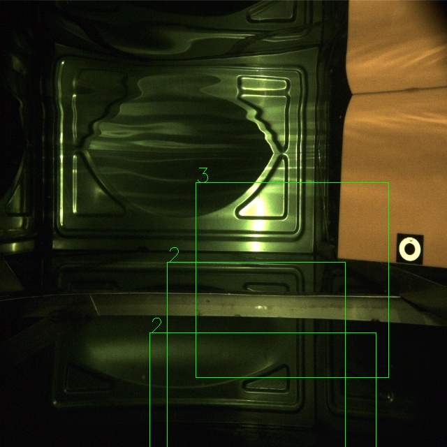

# 目标检测整体流程复现
## 整体步骤
1. 数据集构建和预处理
2. 检测网络结构构建
3. 后处理机制
    a. NMS 非极大值抑制
    b. 预测标签和真实标签匹配
4. 损失函数设计
5. 训练
6. 测试
7. 整体方法效果评估
## 数据集构建和预处理
1. pytorch的dataloader构建原理

    - 需要重写Dataset类的一些方法, __getitem__ 会接收一个index参数,这个参数可以是随机的,表示数据集中第几个样本
    - dataloader会根据batch_size收集固数量样本组成一个batch,这个batch的样本可以被变换,组成一个batch的操作由函数collate_fn完成,训练时数据增强这一步发生在这里
    - 最后返回一个batch的样本和标签
    - 过程中问题有每个物体标签的数量不一致,存入和取出对其物体
## 构建网络
- 简单网络主干由卷积和残差连接组成,最后接了一个输出预测头
- 输出大小分别为 torch.Size([16, 5, 20, 20]) torch.Size([16, 4, 20, 20]), 代表batch_size为16, 输出大小为20x20, 每个位置目标类别概率4个, 盒子数量1个加上置信度
- 导出模型与可视化
- torch.onnx.export(model, x, "model.onnx")

## 后处理机制
1. 置信度阈值过滤和非极大值抑制
    - 对每张图的盒子预测置信度由高到低把下标排个序,若发现置信度最高的小于给定置信度阈值,终止循环(比如这里是0~399下标排序)
    - 选出第一个也就是置信度最高的,计算他和其他box的iou,将重叠度高的其他box丢弃
    - 重复循环直到所有box都处理完
    - 返回的结果就是所有最好的复测标签下标记
    - NMS伪代码
    ```python
    函数 nms(boxes, scores, threshold):
        boxes_to_keep = []
        排序 boxes 按照 scores 的降序顺序
        while boxes 非空:
            取出得分最高的 box
            将其加入 boxes_to_keep
            移除其他与当前 box 有重叠面积大于阈值的 boxes
        返回 boxes_to_keep
    ```
    - IOU计算: IOU = (Intersection Area) / (Union Area)
    
    ```python
    area1 = (xmax1 - xmin1) * (ymax1 - ymin1)
    area2 = (xmax2 - xmin2) * (ymax2 - ymin2)
    area_union = area1 + area2 - area_intersection

    iou = area_intersection / (area_union + eps)
    ```

2. 标签匹配
- 基本想法计算每个真实标签和每个预测标签的iou,会得到一个iou矩阵,然后取出每个和每个真实标签对应最大iou的下标,这样就得到了个真实标签一一对应的预测标签
举个例子:
    |IOU|预测标签1|预测标签2|预测标签3|预测标签4|预测标签400|
    |---|---|---|---|---|---|
    |真实标签1|0.3|0.4|0.5|<b>0.6|0.1|
    |真实标签2|0.1|0.6|0.3|0.8|<b>0.9|
    |真实标签x|.|.|.|.|.|
    |真实标签n|0.5|0.55|0.1|0.4|<b>0.6|
- 网上搜的伪代码
```python
函数 match_boxes(predicted_boxes, true_boxes, iou_threshold):
    matched_indices = []
    for each predicted_box in predicted_boxes:
        best_iou = 0
        best_true_box_index = -1
        for each true_box in true_boxes:
            计算 predicted_box 和 true_box 的 IoU（交并比）
            如果 IoU 大于等于阈值，并且 IoU 大于当前最佳 IoU：
                更新当前最佳 IoU 和最佳匹配的真实框索引
        如果找到了匹配的真实框索引：
            将该预测框索引和匹配的真实框索引添加到 matched_indices 中
    返回 matched_indices
```
## 常用损失函数
1. box_loss用MSE损失,每个位置的预测box和真实box的坐标均方差
$$MSE = \frac{1}{n} \sum_{i=1}^{n} (y_i - \hat{y}_i)^2$$
2. cls_loss用交叉熵损失,交叉熵损失公式为：
\[ J(\theta) = -\frac{1}{m} \sum_{i=1}^{m} \sum_{j=1}^{k} y_j^{(i)} \log(\hat{y}_j^{(i)}) \]

其中：
- \( m \) 是样本数量；
- \( k \) 是类别数量；
- \( y_j^{(i)} \) 是第 \( i \) 个样本的真实标签的第 \( j \) 个元素；
- \( \hat{y}_j^{(i)} \) 是第 \( i \) 个样本的模型预测的类别 \( j \) 的概率。
3. 代码中都使用MSE损失
```python
    loss_coor = ((gt_boxes[..., :2] - pred_boxes[..., :2]) ** 2 \
                + (torch.sqrt(pred_boxes[..., 2:4]) - torch.sqrt(gt_boxes[..., 2:4])) ** 2).sum(dim=-1)

    loss_confidence = (gt_boxes[..., 4] - pred_boxes[..., 4]) ** 2
    # print(loss_coor.shape)

    loss_class = ((pred_classes - gt_classes) ** 2).sum(dim=-1) * have_obg
    # print(loss_class.shape)

    loss_noOb = (gt_boxes[..., 4] - pred_boxes[..., 4]) ** 2 * no_obj

    loss = (1.0 * loss_coor + loss_confidence + loss_class + 0.1 * loss_noOb).mean()

```
## 训练
    - epochs 50
    - batch_size 16
    - optiimzer SGD lr=0.01 weight_decay=0.005
    - 训练完成 保存模型
## 测试
    - 挑选一张图片进行缩放 正则化
    - 输入网络得到预测结果
    - 将预测结果进行后处理
        - 执行NMS和置信度阈值筛选
    - 可视化最终保留预测框
    - 结果如图所示 



## 问题 
1. 不知道为什么效果不好 看训练的损失是已经下降到很低的程度了
2. 在进行box和真实box匹配的时候,没有用上20x20中的位置信息
3. 改用了yolo的grid预置偏移坐标后,效果也不是很好